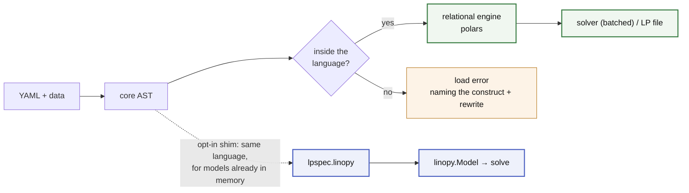

# lpspec

**Self-documenting optimisation models — at any scale.**

Write the math in YAML, bind data at runtime, solve. Today that means linear and
mixed-integer programs. The model is never a dense Python object: it is tidy
frames — masks are absent rows, and a variable's label *is* the solver's own
column index — assembled relationally and handed to the solver in batches.

The consequence worth the headline is **cost to a loaded solver** — YAML and
data in, a populated solver out, no LP file anywhere in between. Measured
against linopy's own best path to the same place, on the top rung of
each of five benchmark cases — 1M to 12M variables
([benchmarks](docs/benchmarks.md)):

- **2–4x faster on four of the five**, and 1.13x slower on the fifth, which is
  in the ladder to be lost — its parameters are dense over the whole variable
  product, the one shape that suits an array engine.
- **Lower peak on all five**, from 0.95x to 0.32x. The margins are narrow at
  the top because HiGHS's own copy of the model dominates once it is loaded, and
  nothing on either side can shrink it.

Read the sink you use: through the *LP file* the picture is closer, and on one
case we are behind on peak. That table is in the same file, next to this one.

A third property is architectural rather than measured, and named here as such:
**nothing accumulates between builds** — no process-wide state, no lifetime to
leak — so the hundredth rolling-horizon window should cost what the first did.
No benchmark pins that yet; it is [on the
list](docs/benchmarks.md#not-measured-yet).

And because the math is a closed spec known before any data is touched, every
name, dimension and expression is checked at load time — `check()` compiles a
whole model repository in CI with nothing bound to it at all.

<!--flow-start-->

<!--flow-end-->

## Example

<!--quickstart-start-->
<!--model-start-->
```yaml
# dispatch.yaml
dimensions:
  snapshot: {dtype: int}
  generator: {values: [wind, solar, gas]}
parameters:
  p_max: {dims: [generator]}
  load:  {dims: [snapshot]}
  cost:  {dims: [generator]}
variables:
  p:
    foreach: [snapshot, generator]
    where: "p_max > 0"
    bounds: {lower: 0, upper: p_max}
constraints:
  power_balance:
    foreach: [snapshot]
    expression: sum(p, over=generator) == load
objectives:
  total_cost:
    sense: minimize
    expression: p * cost
```
<!--model-end-->

<!--solve-start-->
```python
import lpspec as lps, polars as pl

generators = ['wind', 'solar', 'gas']
sources = {
    'p_max': pl.DataFrame({'generator': generators, 'value': [100.0, 60.0, 200.0]}),
    'cost': pl.DataFrame({'generator': generators, 'value': [1.0, 2.0, 50.0]}),
    'load': pl.DataFrame({'snapshot': range(6), 'value': [80.0, 120.0, 150.0, 180.0, 140.0, 100.0]}),
}

result = lps.solve('dispatch.yaml', sources, coords={'snapshot': range(6)})
print(result.objective)  # 1920.0
print(result.primal('p'))  # a tidy frame: (snapshot, generator, value)
print(result.dual('power_balance'))  # the price at each snapshot
```

Sources can also be pandas or pyarrow objects, or parquet paths — anything
exposing the Arrow PyCapsule protocol is accepted, and the recogniser imports
none of them. Results come back as frames, so nothing has to be released and
no dataframe library is a dependency: `result.to_pandas('p')`,
`.to_dataarray('p')` and `.to_parquet(dir)` are the bridges out, each named for
what it costs.
<!--quickstart-end-->

## Why

- **Declarative math** — readable without knowing the implementation, and
  self-contained: no Python state changes what a file means. It diffs cleanly in
  review and travels as a research artefact.
- **Sparse by construction** — a mask is an absent row, never a NaN in a dense
  array, so a model pays for the variables it has rather than for its coordinate
  product. Labels *are* the solver's own row and column indices, with no mapping
  in between, which is also what makes reading results a join.
- **Fail early, fail loud** — every expression, `where` string and even *uncalled*
  macro template is parsed and name-checked before a single source is bound.
  Errors name the problem and its rewrite; nothing falls back silently.
- **A finite language with a priced way out** — the ceiling is a closure
  (relational ∩ local), not a feature race; genuinely unsayable math
  goes in an `escape:` island, visible in the file and billed before it runs.

The second use case is bolting YAML math onto a Python-built model. Packages
like PyPSA let users modify their core math through callbacks — maximally
flexible, but the modification is invisible in the results, the math hides
inside wiring code, and a Python function is not a sharable artefact. When the
modification *is just math*, a file fixes all three:

```python
from lpspec import linopy as lpspec_linopy

lpspec_linopy.extend(m, 'ramp.yaml', data={'ramp_max': network.generators['ramp_max']})
```
<!-- an extension: `p` is declared by the model it extends -->
<!-- doctest: skip -->
```yaml
# ramp.yaml — `p` comes from the model; dims are declared here but their
# coordinates are inferred from it, so no `values:` is needed
dimensions: {snapshot: {dtype: int}, generator: {}}
parameters: {ramp_max: {dims: [generator]}}
constraints:
  ramp_up:
    foreach: [snapshot, generator]
    where: "ramp_max"
    expression: p - shift(p, over=snapshot, by=1) <= ramp_max
```

[linopy](https://github.com/PyPSA/linopy) is **not a runtime dependency**. The
shim above is opt-in, and the same install doubles as the **oracle** every
language feature is differentially tested against — all three relationships are
[one page](docs/design/linopy.md). There is no routing and no fallback: a
construct outside the language is a load error naming its rewrite.

## Docs

Start with [**writing a model**](docs/guide.md) — five ideas, each shown in a
model that runs. Then [the models](docs/models/index.md) to browse,
[SPEC](docs/SPEC.md) for the exact rule, [ARCHITECTURE](docs/ARCHITECTURE.md)
for why it is shaped this way and [ROADMAP](docs/ROADMAP.md) for what is
refused. All of it is indexed in [docs/](docs/README.md); to work on it,
[CONTRIBUTING.md](CONTRIBUTING.md).

To see it rather than read it, `python examples/walkthrough.py` runs one small model through every stage — YAML → schema → core AST → logical plan → model frames → LP text → solution — printing the artifact each stage produces, plus two models the language refuses and why. Its output is committed as [examples/walkthrough.out](examples/walkthrough.out) if you would rather just read that.

```bash
pip install lpspec  # the relational engine (polars, highspy)
pip install "lpspec[linopy]"  # adds linopy + xarray + pandas: the shim, the
                              # oracle, and to_pandas / to_dataarray
pip install "lpspec[gurobi]"  # adds the gurobi sink: solver_name='gurobi'
```

Not a solver wrapper, not a domain package, not a data-loading layer — bring
polars, pandas or xarray objects, Arrow tables, or parquet paths. MIT licensed.

## Status

Alpha, pre-1.0.

<!--status-start-->
**Breaking changes land without a deprecation cycle.** When a construct is
named wrong, a default is wrong, or a permissive input turns out to hide a
silent wrong answer, it gets fixed rather than aliased — carrying a
compatibility shim for every earlier spelling would defeat the point of a small
language.

In practice: pin an exact version if you depend on this, and read the
[changelog](https://github.com/fluxopt/lpspec/blob/main/CHANGELOG.md) before upgrading — every entry links the PR that
describes the break, and a retired spelling fails at load naming its rewrite
rather than drifting on silently. What exists is tested: real models round-trip
through solve, differentially verified against linopy. It is the
*surface* that is not yet frozen, not the behaviour.
<!--status-end-->
